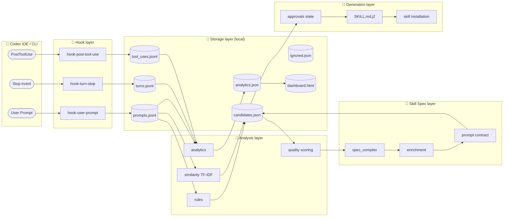
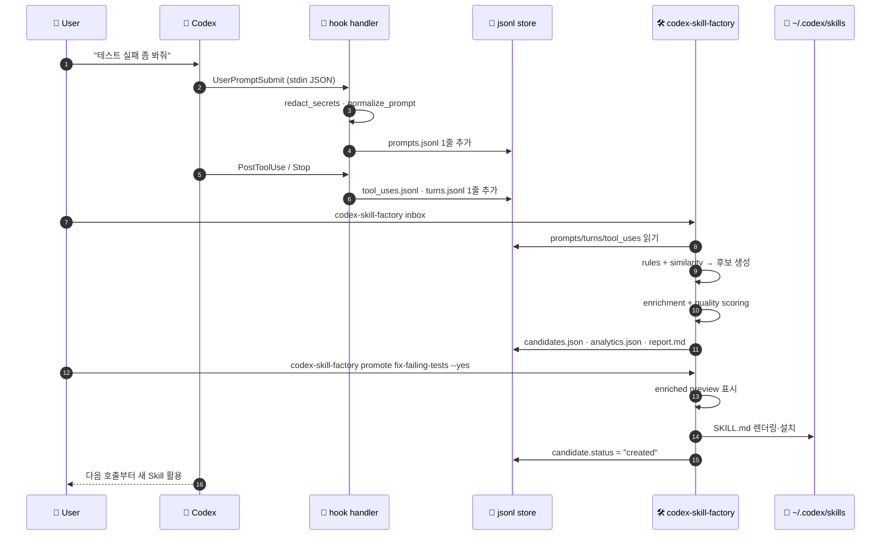
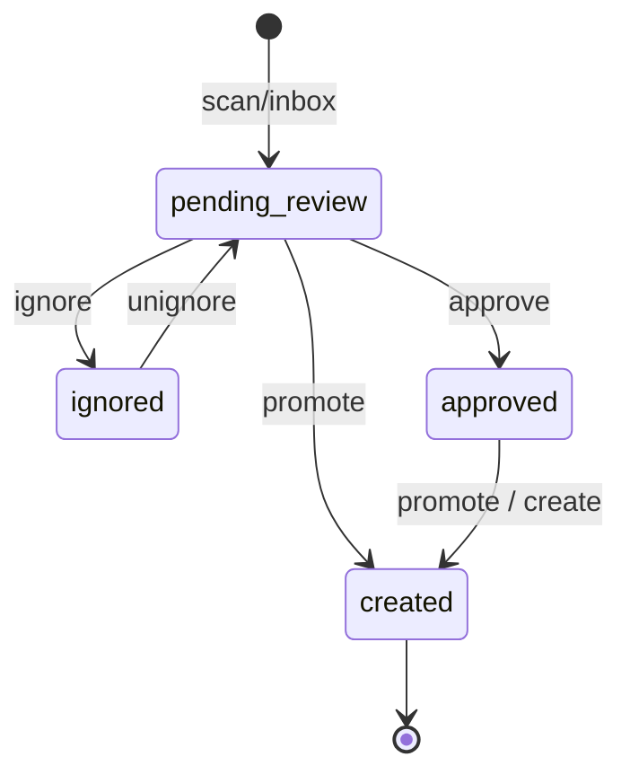

<div align="center">

# 🛠️ Codex Prompt Skill Factory

**누구나 설치해서 Codex 프롬프트 사용 패턴을 로컬에서 수집·분석하고,  
반복 요청을 Skill 후보로 제안하며, 승인된 후보를 Codex가 바로 사용할 수 있는 Skill로  
자동 생성·설치하는 installable CLI 제품**

[](https://www.python.org/)
[](https://typer.tiangolo.com/)
[](https://github.com/Textualize/rich)
[](https://jinja.palletsprojects.com/)
[](https://pytest.org/)
[](https://docs.astral.sh/ruff/)
[](#-개발-현황)
[](#)
[](#-제품-원칙)
[](#-제품-원칙)

[빠른 시작](#-빠른-시작) ·
[아키텍처](#-아키텍처) ·
[명령 체계](#-명령-체계) ·
[데이터 흐름](#-데이터-흐름) ·
[디렉터리 구조](#-디렉터리-구조) ·
[개발 현황](#-개발-현황) ·
[에이전트 룰](AGENTS.md)

</div>

---

## 📌 한눈에 보기

> Codex가 매일 받는 비슷비슷한 프롬프트(`테스트 깨졌어`, `lint 고쳐줘`, `이 diff 리뷰해줘` …)를  
> **로컬 후크 → 분석 → 승인 → Skill 자동 설치**까지 한 흐름으로 처리하는 CLI 도구입니다.

| | 무엇을 하나 | 어떻게 다른가 |
|---|---|---|
| 🎣 **수집** | Codex의 `UserPromptSubmit` / `Stop` / `PostToolUse` hook 으로 프롬프트와 도구 호출을 jsonl로 기록 | secret 패턴 (`sk-…`, `ghp_…`, `Bearer …`)을 **저장 전 마스킹** |
| 🧠 **분석** | 키워드 규칙 + TF-IDF 코사인 유사도 클러스터링으로 반복/유사 프롬프트 추출 | **외부 LLM/API 없이** 로컬 결정론적 동작 |
| 📐 **명세화** | task archetype, variable slot, prompt contract, quality score를 자동 컴파일 | 단순 빈도 카운트가 아닌 **재사용 가능한 Skill Spec** 생성 |
| ✅ **승인** | `inbox` / `preview` / `promote` / `ignore` 로 사람이 마지막에 결정 | **사용자 승인 없이는 Skill을 만들지도, 활성화하지도 않음** |
| 🚀 **설치** | 승인된 후보를 Jinja2 템플릿으로 `SKILL.md`를 렌더링해 Codex skills 디렉터리에 설치 | Prompt Quality Guide·Better Prompt Templates·Clarifying Questions 자동 첨부 |
| 📊 **운영** | analytics·dashboard.html·doctor 명령으로 상태와 성공률을 시각화 | repo-local 스크립트가 아닌 **누구나 설치 가능한 패키지형 CLI** |

---

## ⚡ 빠른 시작

```bash
# 1. 설치 (편집 가능한 설치)
pip install -e tools/codex-skill-factory

# 2. 사용자 환경 또는 프로젝트에 hook/저장소/skill 디렉터리 준비
codex-skill-factory init                  # user scope (~/.codex)
codex-skill-factory init --repo . --yes   # project scope

# 3. 평소처럼 Codex 사용 → hook 이 프롬프트/턴/도구호출을 자동 기록

# 4. 후보 inbox 확인
codex-skill-factory inbox

# 5. 승인된 후보를 Codex Skill 로 즉시 설치
codex-skill-factory promote fix-failing-tests --yes

# 6. 상태/품질 검증
codex-skill-factory dashboard   # → .codex-skill-suggestions/dashboard.html
codex-skill-factory doctor      # → 설치/저장/hook 상태 점검
```

> [!TIP]
> **VS Code 사용자**는 `Tasks: Run Task → Codex Skill Factory: Inbox / Dashboard` 로 동일한 흐름을 한 번에 실행할 수 있습니다. (`.vscode/tasks.json` 참고)

---

## 🧱 제품 원칙

| 🏷️ 원칙 | 의미 |
|---|---|
| 🔒 **Local-first** | 프롬프트 로그·후보·분석 결과는 사용자 로컬에만 저장. 외부 전송 없음. |
| 🛡️ **Approval-first** | 사용자 승인 없이 Skill을 생성하거나 활성화하지 않음. |
| 📦 **Installable CLI** | repo-local 스크립트가 아니라 `pip` / `pipx` 로 설치 가능한 CLI 제품. |
| ⚙️ **Deterministic default** | 기본 분석은 외부 LLM/API 없이 재현 가능한 로컬 규칙·유사도 분석으로 동작. |
| 🧭 **Project-aware** | 모든 로그에 `cwd`, `repo_root`, `project_name`, git branch/commit 메타데이터 포함. |
| 🤐 **No secret retention** | OpenAI/GitHub/Slack 토큰, API key, password/secret/bearer 패턴은 저장 전 마스킹. |
| 🎯 **Product UX first** | 사용자는 `init` / `inbox` / `promote` / `dashboard` / `doctor` 5개 명령만으로 운영. |

---

## 🏗️ 아키텍처

### 전체 구성



### 모듈 책임 매트릭스

| 레이어 | 모듈 | 책임 | 핵심 함수 / 객체 |
|---|---|---|---|
| **CLI UX** | [`cli.py`](tools/codex-skill-factory/skill_factory/cli.py) | Typer 기반 사용자 진입점, 명령 라우팅, hook 설정 자동 작성 | `app`, `init`, `inbox`, `promote`, `dashboard`, `doctor`, `build_hooks_config`, `ensure_product_files` |
| **Hook** | [`hook_handlers.py`](tools/codex-skill-factory/skill_factory/hook_handlers.py) | stdin JSON payload 파싱 → secret redaction → 정규화 → jsonl 저장 | `handle_user_prompt`, `handle_turn_stop`, `handle_post_tool_use`, `redact_secrets`, `normalize_prompt` |
| **Storage** | [`storage.py`](tools/codex-skill-factory/skill_factory/storage.py) | user/project 두 scope의 표준 경로 결정, jsonl/json 안전 IO | `Paths`, `get_paths`, `find_repo_root`, `read_jsonl`, `write_json` |
| **Analysis** | [`rules.py`](tools/codex-skill-factory/skill_factory/rules.py) | 5가지 사전 정의된 키워드 규칙 (`fix-failing-tests`, `fix-lint-type-errors`, `review-current-diff`, `update-docs`, `repo-to-infographic`) | `RULES`, `classify_prompt`, `get_rule` |
| | [`similarity.py`](tools/codex-skill-factory/skill_factory/similarity.py) | TF-IDF + 문자 n-gram 토크나이저 + 코사인 유사도 + 연결요소 클러스터링 | `tokenize`, `build_embeddings`, `find_similarity_clusters`, `build_similarity_candidates` |
| | [`analytics.py`](tools/codex-skill-factory/skill_factory/analytics.py) | 명령 성공률(test/lint/other), 반복 fix 신호, top repeated prompts 집계 | `compute_analytics`, `classify_command`, `_top_repeated_prompts` |
| | [`quality.py`](tools/codex-skill-factory/skill_factory/quality.py) | 7차원 품질 점수, 진단, 더 나은 프롬프트 템플릿, 확인 질문 생성 | `compute_quality`, `generate_prompt_templates`, `generate_clarifying_questions`, `enrich_quality` |
| **Spec** | [`spec_compiler.py`](tools/codex-skill-factory/skill_factory/spec_compiler.py) | task archetype 추론(fix/create/review/…) + variable slot 추출 + prompt contract 생성 | `infer_task_archetype`, `extract_variable_slots`, `build_prompt_contract`, `compile_skill_spec` |
| | [`enrichment.py`](tools/codex-skill-factory/skill_factory/enrichment.py) | 후보에 `skill_spec` 합성 (compile + quality enrich) | `enrich_candidate`, `enrich_candidates` |
| **Approval** | [`approvals.py`](tools/codex-skill-factory/skill_factory/approvals.py) | 후보 상태 머신: `pending_review` ↔ `ignored` / `approved` → `created` | `apply_existing_statuses`, `set_candidate_status`, `ignore_candidate`, `unignore_candidate` |
| **Generation** | [`templates/SKILL.md.j2`](tools/codex-skill-factory/skill_factory/templates/SKILL.md.j2) | Codex가 즉시 소비할 수 있는 frontmatter + Skill 본문 + Prompt Quality Guide | Jinja2 템플릿 |
| **Dashboard** | [`dashboard.py`](tools/codex-skill-factory/skill_factory/dashboard.py) | 다크모드 단일 HTML 대시보드 + JSON 데이터 export | `build_dashboard_data`, `render_dashboard_html` |

---

## 🔄 데이터 흐름



---

## 🧭 명령 체계

### 제품 Golden Path (사용자가 알아야 할 5개)

| 명령 | 한 줄 요약 | 주요 옵션 |
|---|---|---|
| 🟢 `init` | hook 설정 + 저장소 + skills 디렉터리를 한 번에 준비 | `--repo`, `--project`, `--yes`, `--dry-run` |
| 🔵 `inbox` | 로그 스캔 → 후보·analytics 갱신 → 인터랙티브 처리 | `--no-interactive`, `--include-ignored`, `--min-frequency`, `--similarity-threshold` |
| 🟣 `promote <name>` | 후보 승인 + `SKILL.md` 생성·설치를 원자적으로 처리 | `--overwrite`, `--evidence`, `--force`, `--yes` |
| 🟡 `dashboard` | 대시보드 HTML/JSON 생성 (VS Code Simple Browser 호환) | `--repo` |
| 🩺 `doctor` | 설치·저장소·hook 무결성 점검 (`--json` 모드 지원) | `--repo`, `--project`, `--json` |

### 고급/내부 명령

<details>
<summary><b>전체 명령 표 펼치기</b></summary>

| 명령 | 카테고리 | 용도 |
|---|---|---|
| `scan` | 분석 | 후보만 다시 계산하고 inbox 표는 생략 |
| `report` | 분석 | 저장된 후보 표를 콘솔에 다시 렌더 |
| `preview <name>` | 분석 | 후보 1개의 SKILL.md 본문 미리보기 |
| `approve <name>` | 승인 | 상태만 `approved` 로 변경 (파일 미생성) |
| `ignore <name>` | 승인 | inbox에서 숨김 (`--reason` 메모 가능) |
| `unignore <name>` | 승인 | ignored → pending_review 복구 |
| `review` | 승인 | pending 후보 일괄 인터랙티브 검토 |
| `enrich [<name>]` | 명세화 | 후보 1개/전체에 skill_spec 재생성 |
| `create <name>` | 생성 | 승인 절차 없이 SKILL.md 만 생성 (CI 등) |
| `analytics` | 운영 | 콘솔에 KPI 표 표시 + analytics.json 갱신 |
| `hook-user-prompt` | 내부 | Codex hook이 직접 호출 (사용자가 직접 X) |
| `hook-turn-stop` | 내부 | 동일 |
| `hook-post-tool-use` | 내부 | 동일 |

</details>

### 후보 상태 머신



---

## 📂 디렉터리 구조

```text
codex-autocreator-skill/
├─ 📄 README.md                                     ← 본 문서
├─ 📁 .codex/                                       ← project-scope Codex 설정
│  ├─ config.toml                                   ← codex_hooks = true
│  ├─ hooks.json                                    ← 3개 hook 등록
│  └─ hooks/                                        ← legacy 직접 실행 hook 스크립트
├─ 📁 .vscode/
│  └─ tasks.json                                    ← Inbox/Analytics/Dashboard tasks
├─ 📁 docs/                                         ← 제품 기준 문서
│  ├─ codex_prompt_skill_factory_dev_doc.md         ← 🥇 최우선 기준 (현행)
│  └─ codex_prompt_skill_factory_product_plan_expert_review.md
├─ 📁 dev-plan/                                     ← 페이즈별 구현 기록
│  └─ implement_YYYYMMDD_HHMMSS.md
└─ 📁 tools/codex-skill-factory/                    ← 📦 설치형 패키지 본체
   ├─ pyproject.toml                                ← entry_point: codex-skill-factory
   ├─ skill_factory/
   │  ├─ cli.py            (820 lines)              ← Typer 명령 19개
   │  ├─ hook_handlers.py  (353 lines)              ← stdin → jsonl, secret redaction
   │  ├─ storage.py        (125 lines)              ← Paths dataclass + IO 유틸
   │  ├─ rules.py          (186 lines)              ← 5개 사전정의 룰
   │  ├─ similarity.py     (265 lines)              ← TF-IDF + cosine clustering
   │  ├─ analytics.py      (215 lines)              ← KPI 집계
   │  ├─ quality.py        (133 lines)              ← 7차원 품질 점수
   │  ├─ spec_compiler.py  (270 lines)              ← prompt contract 컴파일
   │  ├─ enrichment.py     ( 24 lines)              ← 합성 진입점
   │  ├─ approvals.py      ( 60 lines)              ← 상태 머신
   │  ├─ dashboard.py      (148 lines)              ← 정적 HTML 렌더
   │  └─ templates/SKILL.md.j2                      ← Codex Skill 템플릿
   └─ tests/               (9 files / 403 lines)    ← pytest
      ├─ test_cli.py        ← E2E CLI 시나리오 (init→inbox→promote→doctor)
      ├─ test_storage.py    ← user/project scope, jsonl 손상 처리
      ├─ test_rules.py      ← classify_prompt 매칭
      ├─ test_similarity.py ← 클러스터링 정확도
      ├─ test_spec_compiler.py ← archetype/slot/contract
      ├─ test_quality.py    ← 7차원 점수 + diagnostics
      ├─ test_enrichment.py ← skill_spec 합성
      ├─ test_analytics.py  ← KPI 집계
      └─ test_dashboard.py  ← HTML/JSON 렌더
```

### 런타임 산출물 (gitignored)

```text
~/.codex/                                  ← user scope
├─ prompt-history/{prompts,turns,tool_uses}.jsonl
├─ skill-factory/{candidates,ignored,analytics}.json + dashboard.{html,json} + report.md
└─ skills/<skill-name>/SKILL.md            ← Codex 가 직접 소비

<repo>/                                    ← project scope (--repo .)
├─ .codex-prompt-history/...
├─ .codex-skill-suggestions/...
└─ .codex/skills/<skill-name>/SKILL.md
```

---

## 🧪 검증 & 품질

### 테스트 실행

```bash
# 가상환경에서
pip install -e "tools/codex-skill-factory[dev]"

# 단위 + CLI E2E
pytest tools/codex-skill-factory

# 정적 분석
ruff check tools/codex-skill-factory
```

### 보안 시나리오 (S2)

| 입력 패턴 | 저장 결과 |
|---|---|
| `sk-abcdef0123456789...` | `[REDACTED_SECRET]` |
| `ghp_xxxxxxxxxxxxxxxxxxxx` | `[REDACTED_SECRET]` |
| `Authorization: Bearer …` | `[REDACTED_SECRET]` |
| `api_key=value` / `password: …` | `[REDACTED_SECRET]` |

> hook은 stdin payload를 jsonl로 그대로 직렬화하지 않고 **필요한 키만 추출**한 뒤 redaction을 적용합니다.

### 품질 점수의 7차원

| 차원 | 의미 | 임계 진단 |
|---|---|---|
| `intent_clarity` | 목표가 한 문장으로 명확한가 | — |
| `input_specificity` | 작업 대상/입력이 evidence로 명시됐는가 | < 70 → "입력 대상 불명확" |
| `constraint_clarity` | 수정 범위/금지사항 분리 | < 70 → "제약 보강 필요" |
| `workflow_reusability` | 반복 가능한 절차 단계 수 | — |
| `verification_strength` | 검증 명령/기준 존재 | < 70 → "검증 부족" |
| `output_specificity` | 결과 섹션 명시 | — |
| `generalization_safety` | 특정 파일/날짜 과적합 위험 | < 80 → "변수화 권장" |

---

## 🚦 개발 현황

### 현재 v0.1.0 (2026-05-03 기준)

- ✅ 제품 Golden Path: `init` · `inbox` · `promote` · `doctor` · `dashboard`
- ✅ user scope (`~/.codex`) 와 project scope (`--repo .`) 동시 지원
- ✅ Codex hook 자동 등록 (`config.toml [features] codex_hooks = true` + `hooks.json`)
- ✅ secret redaction (OpenAI/GitHub/Slack/Bearer/key·secret 패턴)
- ✅ 규칙 + TF-IDF 유사도 기반 후보 생성, 7차원 품질 점수
- ✅ Prompt Contract / Variable Slot / Better Prompt Templates 자동 첨부
- ✅ 정적 HTML dashboard (다크 모드, VS Code Simple Browser 호환)
- ✅ pytest 9개 모듈 + ruff 통과

### 명시적 비목표 (v1)

- ❌ 외부 LLM/API 필수 의존
- ❌ 클라우드 동기화 / 팀 SaaS
- ❌ VS Code Extension (tasks.json은 보조)
- ❌ Codex 자체 코드 수정

---

## 📚 더 읽어볼 문서

| 문서 | 역할 |
|---|---|
| 🤖 [`AGENTS.md`](AGENTS.md) | **AI 에이전트/개발자 작업 강제 규칙** |
| 🥇 [`docs/codex_prompt_skill_factory_dev_doc.md`](docs/codex_prompt_skill_factory_dev_doc.md) | **현행 최우선 제품 개발 문서** |
| 🧩 [`docs/skill_template_spec.md`](docs/skill_template_spec.md) | **Skill 생성 공용 사양** — 모든 `SKILL.md`가 공유하는 섹션·기본값·archetype·품질 규칙의 단일 진실 소스 |
| 📝 [`docs/codex_prompt_skill_factory_product_plan_expert_review.md`](docs/codex_prompt_skill_factory_product_plan_expert_review.md) | 제품 계획 전문가 리뷰 / 잠금 사항 |
| 📁 [`dev-plan/`](dev-plan/) | 페이즈별 구현 기록 (현행 범위 판단은 위 dev_doc 우선) |

---

<div align="center">

**🛡️ Local · Approval-first · Deterministic — Codex의 일상을 "Skill" 단위로 진화시킵니다.**

</div>
